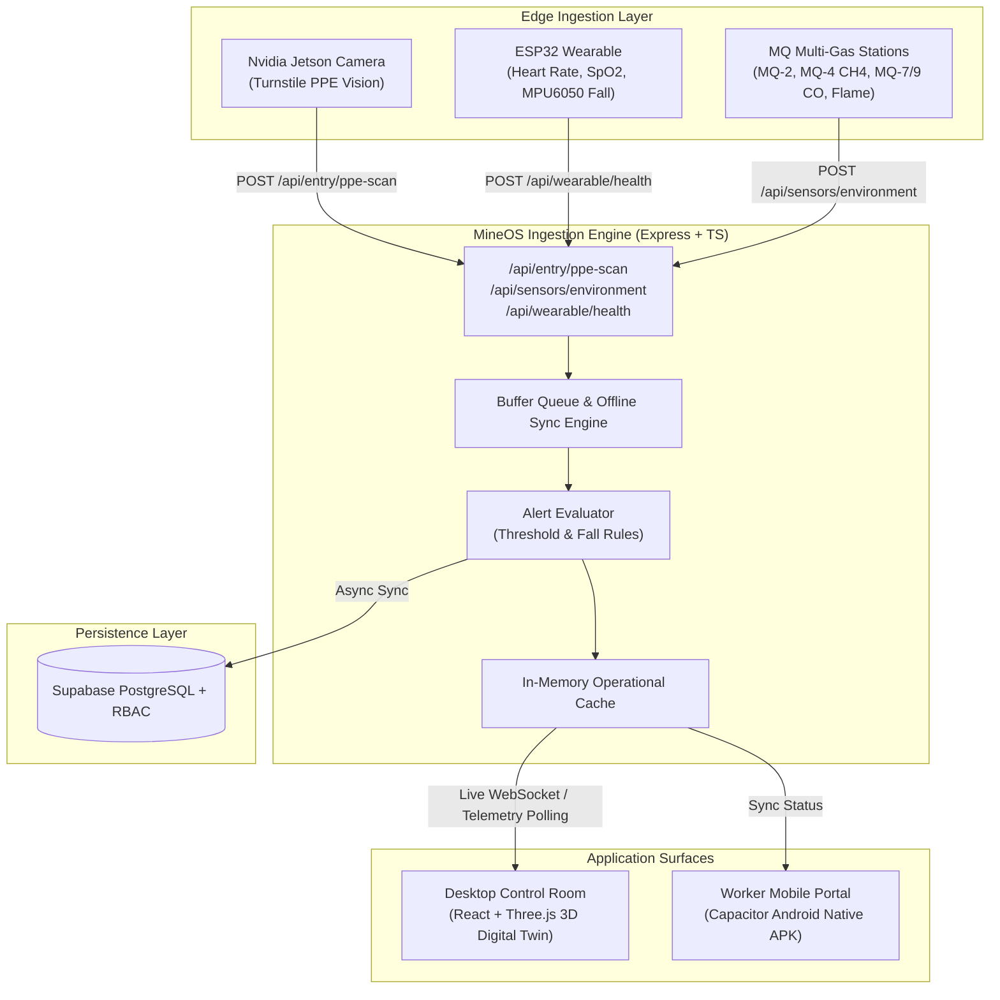

# MineOS — Real-Time Subterranean Mining Safety & Environmental OS

> An industrial IoT and edge-computing safety platform integrating computer-vision PPE compliance, wearable worker telemetry, underground multi-gas sensing, and a 3D digital twin control room.

[](#)
[](#)
[](#)
[](#)
[](#)
[](#)

---

## Problem
Underground mining is among the most hazardous industrial environments globally. Mines face severe safety challenges:
1. **Unenforced PPE Compliance:** Manual turnstile checks fail to prevent workers from entering shaft portals without critical safety equipment (helmets, high-vis vests, heavy-duty gloves, reinforced boots).
2. **Delayed Hazard Detection:** Hazardous atmospheric gas accumulation (Methane $CH_4$, Carbon Monoxide $CO$, Toxic VOCs) often reaches lethal thresholds before surface operators become aware.
3. **Worker Incapacitation Latency:** Falls, rockfall impacts, and medical events (hypoxia, cardiac stress) underground frequently go undetected until shift callout hours later.
4. **Subterranean Connectivity Loss:** Deep shafts frequently lose network access, causing critical sensor logs to be lost.

## Solution
**MineOS** addresses these hazards through a unified edge-to-cloud safety operating system:
- **Automated Turnstile Vision:** Deploys computer vision on an Nvidia Jetson edge device to inspect workers at entry turnstiles, verifying complete PPE compliance before granting portal access.
- **Continuous Wearable Telemetry:** ESP32 smart wearables stream heart rate, blood oxygen ($SpO_2$), and MPU6050 accelerometer readings for instantaneous fall/impact and SOS panic detection.
- **Environmental Gas Grid:** Continuous subterranean monitoring using MQ-2, MQ-4, MQ-7, MQ-9, MQ-135, and optical flame sensors across designated mine zones (`zone-a` to `zone-d`).
- **Offline Resilient Buffer:** Local queuing engine buffers telemetry during subterranean network drops and flushes in batches upon link restoration.
- **Control Room Digital Twin:** An interactive 3D spatial interface built with React Three Fiber providing surface supervisors with real-time zone telemetry, worker locations, and automated siren triggers.

---

## System Architecture



---

## Key Features

### 1. Edge Vision & PPE Gate Enforcement
- Detects Helmet, High-Vis Vest, Gloves, and Boots in real time.
- Turnstile gate integration automatically blocks entry if any critical PPE component is missing.
- Records geo-tagged entry events with photographic audit references.

### 2. Multi-Tier Role-Based Access Control (RBAC)
- **Mine Manager (`mine_manager`):** Full org-wide access, personnel roster management, and emergency broadcast capabilities.
- **Safety Officer (`safety_officer`):** Incident audit logs, safety streak tracking, and PPE compliance enforcement.
- **Shift In-Charge (`shift_incharge`):** Scoped operational view restricted to assigned mine zone and shift.
- **Mine Worker (`mine_worker`):** Personal health dashboard, assigned shift details, and one-tap emergency SOS transmitter.

### 3. Worker Biometrics & Fall Detection
- Ingests accelerometer vectors from MPU6050 IMUs to distinguish normal movement from rapid deceleration impacts and falls.
- Monitors pulse and hypoxia thresholds, dispatching surface alerts if vitals exceed safe operating limits.

### 4. 3D Digital Twin Control Surface
- Renders an interactive 3D topographical map of mine shafts and extraction chambers using `@react-three/fiber` and `@react-three/drei`.
- Live visual indicators depict atmospheric hazard levels in each zone: Green (Nominal), Yellow (Elevated), Red (Critical Hazard).

---

## Tech Stack

| Layer | Technologies Used |
|---|---|
| **Frontend Dashboard** | React 18, TypeScript, Vite, Tailwind CSS, Lucide Icons |
| **3D Visualization** | Three.js, `@react-three/fiber`, `@react-three/drei` |
| **Mobile Application** | Capacitor v6.2.2, Android SDK, Android Native Packaging |
| **Backend Server** | Node.js, Express, TypeScript, CORS, Dotenv |
| **Database & Auth** | Supabase (PostgreSQL), Custom RBAC Row-Level Policies |
| **IoT / Edge Protocols** | JSON Ingestion REST endpoints, Offline Queue Batch Synchronization |

---

## Project Structure

```
mineos/
├── android/                   # Native Android Studio project generated via Capacitor
├── backend/                   # Node.js + Express real-time ingestion server
│   ├── src/
│   │   ├── config/supabase.ts # Cloud database connection & fallback handler
│   │   ├── routes/ingestion.ts# Endpoints for Jetson, wearables & gas sensors
│   │   ├── services/          # Alert evaluator and offline buffer queue
│   │   └── server.ts          # Express server entry point
│   ├── schema.sql             # Complete PostgreSQL relational schema & RBAC definitions
│   └── simulator.js           # Multi-sensor telemetry generation script
├── src/                       # React 18 web and mobile frontend application
│   ├── components/
│   │   ├── controlroom/       # Roster, Gas panels, Alerts feed, Worker telemetry
│   │   ├── shared/            # 3D Digital Twin, PPE Hologram, System header
│   │   └── worker/            # Metric cards, Bottom navigation, Mobile layout
│   ├── context/               # AuthContext (RBAC) & SafetyContext (Live state)
│   ├── pages/
│   │   ├── controlroom/       # Operational dashboards, hazard logs, worker management
│   │   └── worker/            # Live safety, SOS emergency, and personal profile views
│   └── services/              # Mobile telemetry bridge & Supabase client
├── MineOS.apk                 # Packaged Android Application build
├── capacitor.config.ts        # Capacitor configuration for Android runtime
└── vite.config.ts             # Vite build configuration
```

---

## Getting Started

### Prerequisites
- Node.js 18+ and npm / yarn
- Android Studio (optional, for compiling Android APK from source)
- Supabase account (optional, backend includes an in-memory fallback for local development)

### 1. Setup Backend Server
```bash
cd backend
npm install
cp .env.example .env

# Start ingestion server (runs on port 3001)
npm run dev
```

### 2. Run Telemetry Simulator
Generate live simulated feeds representing 4 mine zones and 7 active underground miners:
```bash
# In a new terminal inside /backend:
npm run simulate
```

### 3. Setup and Launch Frontend
```bash
# In the root repository directory:
npm install
npm run dev
```
Navigate to `http://localhost:5173` to view the control room dashboard.

---

## API Ingestion Specifications

### PPE Scan Ingestion (`POST /api/entry/ppe-scan`)
```json
{
  "worker_id": "WM-8492",
  "worker_name": "Vikram Nayak",
  "helmet": true,
  "vest": true,
  "gloves": true,
  "boots": true,
  "gate_id": "Turnstile-01",
  "geo_location": "Portal 01 Incline Shaft [23.795°N, 86.430°E]"
}
```

### Wearable Health & Motion (`POST /api/wearable/health`)
```json
{
  "worker_id": "WM-8492",
  "heart_rate": 84,
  "spo2": 98,
  "body_temp": 36.8,
  "mpu6050": {
    "accel_x": 0.02,
    "accel_y": 0.98,
    "accel_z": 0.11,
    "fall_detected": false
  },
  "sos_triggered": false
}
```

---

## Author
**Nitikasri Achary**  
- GitHub: [@NitikasriJeyanAchary0109](https://github.com/NitikasriJeyanAchary0109)
